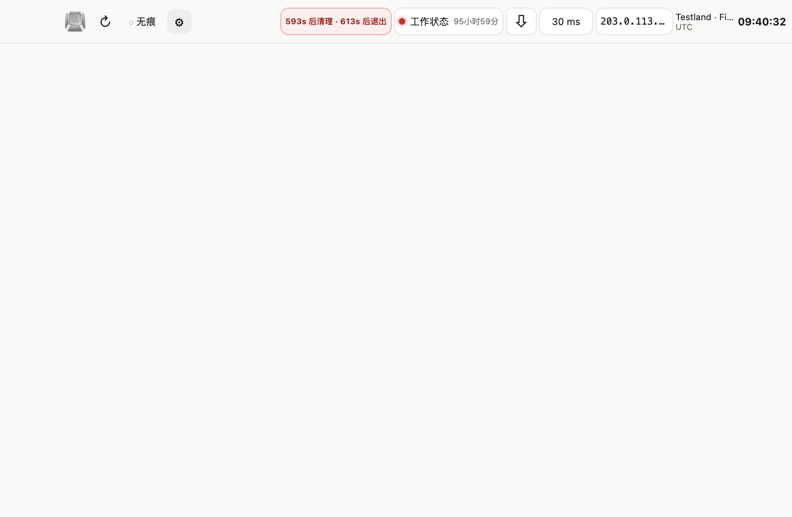
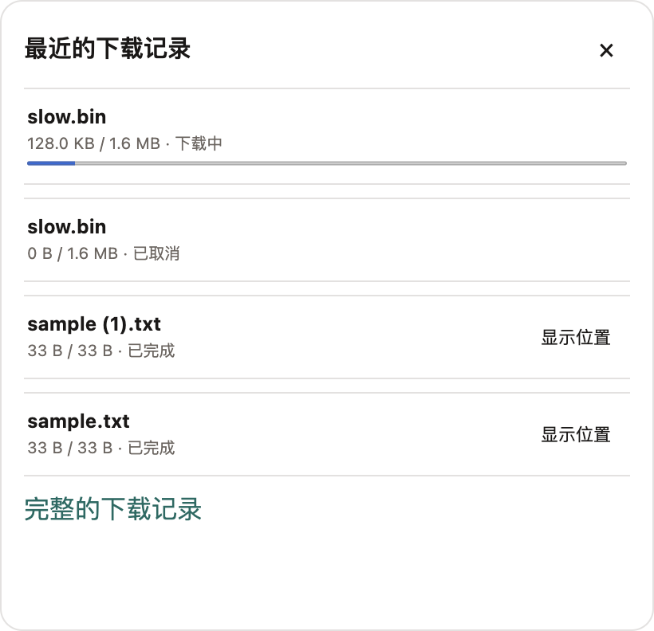
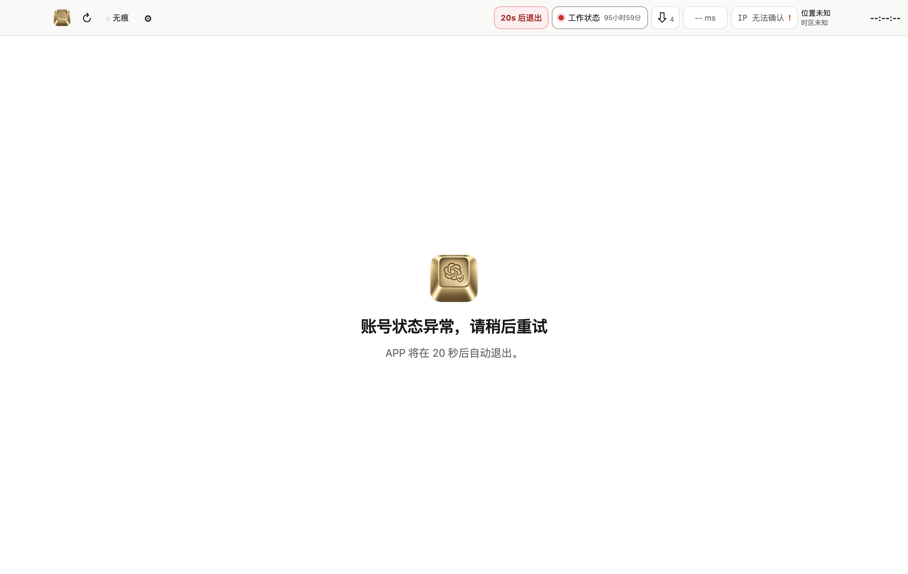

# ChatGPT Web Next

<p align="center">
  
</p>

<p align="center">
  一个面向 macOS 与 Windows 的独立 ChatGPT 桌面容器，提供原生登录、会话隔离、出口网络状态、下载管理和本机会话安全策略。
</p>

<p align="center">
  <a href="README.en.md">English</a> · 简体中文
</p>

<p align="center">
  <a href="https://github.com/IronMan-libingxue/ChatGPT-Web-Next/releases/latest"></a>
  <a href="https://github.com/IronMan-libingxue/ChatGPT-Web-Next/releases"></a>
  
  
  <a href="LICENSE"></a>
</p>

> [!IMPORTANT]
> 本项目是非官方、源码可见的软件，与 OpenAI 没有关联，也未获得其认可。ChatGPT 和 OpenAI 是其各自权利人的商标。使用本软件仍须遵守相关服务条款。

## 快速下载

| 平台 | 推荐版本 | 备用版本 |
| --- | --- | --- |
| macOS（Apple 芯片与 Intel） | [下载 DMG](https://github.com/IronMan-libingxue/ChatGPT-Web-Next/releases/latest/download/ChatGPT-Web-Next-0.2.1-mac-universal.dmg) | [下载 ZIP](https://github.com/IronMan-libingxue/ChatGPT-Web-Next/releases/latest/download/ChatGPT-Web-Next-0.2.1-mac-universal.zip) |
| Windows x64 | [下载安装版](https://github.com/IronMan-libingxue/ChatGPT-Web-Next/releases/latest/download/ChatGPT-Web-Next-0.2.1-windows-x64-setup.exe) | [下载免安装版](https://github.com/IronMan-libingxue/ChatGPT-Web-Next/releases/latest/download/ChatGPT-Web-Next-0.2.1-windows-x64-portable.exe) |

[查看全部版本](https://github.com/IronMan-libingxue/ChatGPT-Web-Next/releases) · [下载 SHA-256 校验清单](https://github.com/IronMan-libingxue/ChatGPT-Web-Next/releases/latest/download/SHA256SUMS.txt)

0.2.1 已在 macOS 上完成完整功能验收；Windows 安装版与免安装版也已由使用者在多台实机、多个 Windows 版本上人工验证通过。由于当前发布包没有 Apple 公证或 Windows 商业代码签名，系统可能显示来源或安全提醒。请只从本仓库 Releases 下载并核对校验值，不要关闭系统安全保护。

## 界面预览

> 预览图使用文档专用示例 IP 和虚构地点，不包含真实账号、聊天内容或网络信息。



<table>
  <tr>
    <td width="42%"></td>
    <td width="58%"></td>
  </tr>
  <tr>
    <td align="center">下载管理</td>
    <td align="center">本机会话安全清理</td>
  </tr>
</table>

## 主要功能

- 保留 ChatGPT 原生 Google 登录弹窗和两步验证流程；普通窗口使用独立、长期保存的登录环境。
- 每个无痕窗口使用单独的临时环境，关闭后删除该窗口的 Cookie、缓存和网页存储。
- 显示 ChatGPT 当前网络环境看到的出口 IP、估计位置、时区、当地时间与响应延迟。
- 提供设备本地的 IP 与会话安全策略，缩短敏感工作会话在本机上的留存时间，降低账号被重复使用、长期无人看管或高并发复用的风险。
- 管理 ChatGPT 下载记录；可在 Finder 或文件资源管理器中定位文件，清空列表不会删除文件。
- 支持普通刷新、忽略缓存刷新、网页缩放、深浅色界面和五款内置图标。
- 设备状态、检测记录、下载记录与界面偏好分开加密保存；不建设云端后台。

## IP 与会话安全策略

应用只在本机观察当前网页会话的必要状态。确认受保护的工作状态已由本机提交并被服务端接受后：

1. 状态灯保持红色，96 小时本地提示重新计算。
2. 界面立即显示不可取消的安全倒计时。
3. 第 10 秒清除本应用中的普通与无痕 ChatGPT 登录信息、Cookie、缓存、网页存储和当前网络显示，并禁止在本轮退出前重新登录。
4. 第 30 秒关闭全部窗口并退出应用。

这是一项本机风险控制，不会复制浏览器 Cookie，不会上报设备记录，也不会停止已经在云端运行的任务。它不能保证 Google 或 OpenAI 不再要求验证，也不是规避安全验证的工具。

## 隐私边界

- 不保存聊天正文、附件内容、密码、验证码、Cookie、令牌、完整请求或完整会话编号。
- 不读取日常 Chrome、Edge、ChatGPT Web 或 ChatGPT Web2 的登录资料。
- 出口位置来自 IPWho.is 的估计，只表示检测当时的网络出口，并非历史登录位置。
- 本地记录最多保存界面允许展示的状态信息；清除网页登录数据不会删除设备安全状态。

更多说明见[隐私与安全](docs/PRIVACY.md)。

## 安装提示

### macOS

本版本使用本机测试签名，不是 Apple Developer ID 公证发行包。如果系统拦截，请先核对 SHA-256，再在“系统设置 → 隐私与安全性”中确认打开；不要全局关闭 Gatekeeper。第一次建立本机加密记录时，系统可能请求访问“ChatGPT Web Next Safe Storage”。

### Windows

Windows 包目前没有商业代码签名，SmartScreen 可能提示未知发布者。请确认下载地址属于本仓库、核对 SHA-256，再决定是否运行。安装版不会在卸载时自动删除应用数据；免安装版同样会把独立资料保存在当前 Windows 用户目录。

## 本地开发

需要 Node.js 24 与 pnpm 11：

```bash
pnpm install --frozen-lockfile
pnpm check
pnpm test:e2e
```

构建安装包：

```bash
pnpm dist:mac
pnpm dist:win
```

真实账号、密码和两步验证必须由使用者本人完成。测试时应设置独立的 `CHATGPT_WEB_NEXT_TEST_ROOT`，不要使用真实安装环境的数据目录。

## 参与项目

提交问题或改进前请阅读 [CONTRIBUTING.md](CONTRIBUTING.md) 和 [SECURITY.md](SECURITY.md)。问题报告中不要附带密码、Cookie、令牌、账号邮箱或聊天正文。

## 作者

- [IronMan-libingxue](https://github.com/IronMan-libingxue)
- [Jessica-yaoyao](https://github.com/Jessica-yaoyao)

完整署名说明见 [AUTHORS.md](AUTHORS.md)。

## 许可

源码按 [PolyForm Noncommercial License 1.0.0](LICENSE) 提供：允许个人学习、研究、测试及其他非商业用途；**不允许商业使用**。如需商业授权，请联系项目所有者另行取得书面许可。

这类带非商业限制的许可属于“源码可见 / source-available”，不是 OSI 定义的开源许可。
